# Configuración del Bot

Esta guía te ayudará a configurar WhatsAppToDiscord paso a paso. No te preocupes por la cantidad de pasos, deseo ser lo más detallado posible :)

## Configuración inicial

Asegúrate de tener el bot descargado y en una carpeta dedicada antes de comenzar.

## Pasos de configuración

1. Ve al [Portal de Desarrolladores de Discord](https://discord.com/developers/applications/).
<details>
  <summary>Ver imagen</summary>
  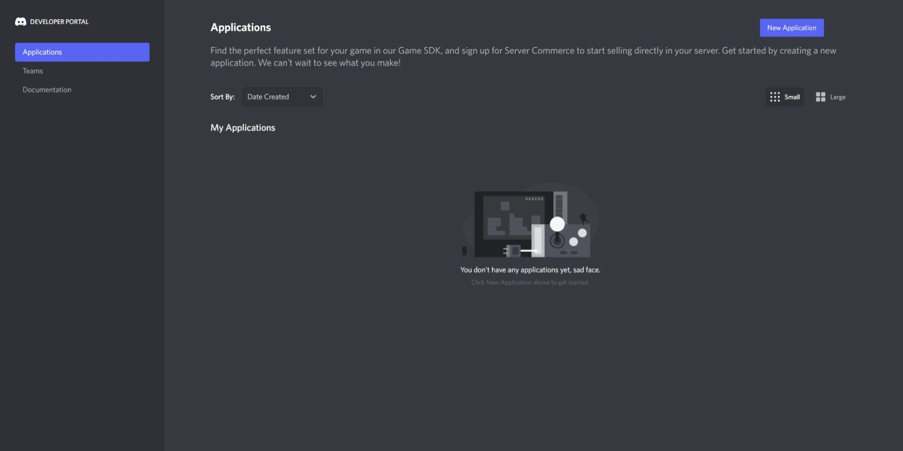
</details>

2. Haz clic en el **botón azul** en la esquina superior derecha con el texto *"Nueva Aplicación"*
<details>
  <summary>Ver imagen</summary>
  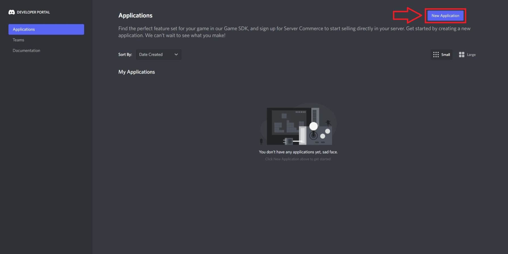
</details>

3. Dale un nombre a tu bot, luego haz clic en *"Crear"*.
<details>
  <summary>Ver imagen</summary>
  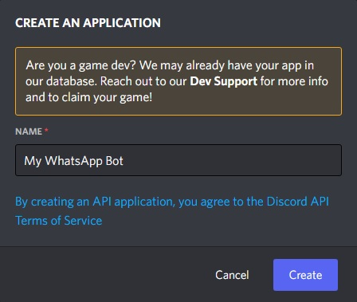
</details>

4. Ve a *"Bot"* usando la barra lateral, luego haz clic en *"Añadir Bot"*, y finalmente en *"Sí, ¡hazlo!"*.
<details>
  <summary>Ver imagen</summary>
  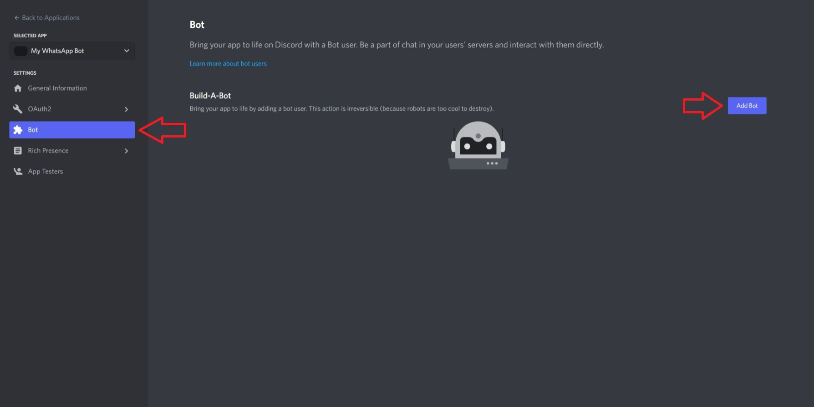
</details>

5. Haz clic en *"Copiar"* para copiar el token de tu bot.
<details>
  <summary>Ver imagen</summary>
  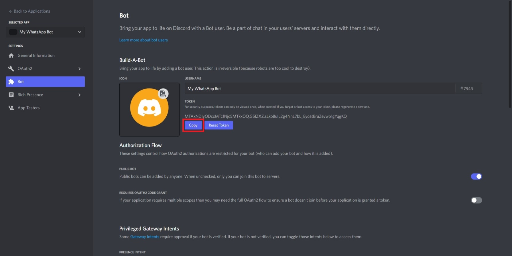
</details>

6. Luego, desplázate hacia abajo y activa *"MESSAGE CONTENT INTENT"*
<details>
  <summary>Ver imagen</summary>
  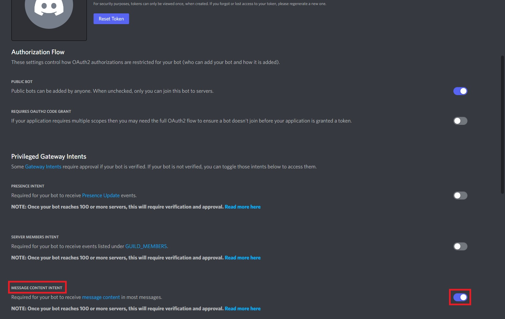
</details>

7. Ahora, ejecuta el bot. (Si usas Windows, Microsoft Defender SmartScreen puede advertirte sobre la ejecución del ejecutable, pero si te sientes inseguro, siempre puedes inspeccionar y ejecutar el código fuente abierto usando Node. Para omitir SmartScreen, puedes hacer clic en *"Más información"*, luego *"Ejecutar"*)
<details>
  <summary>Ver imagen</summary>
  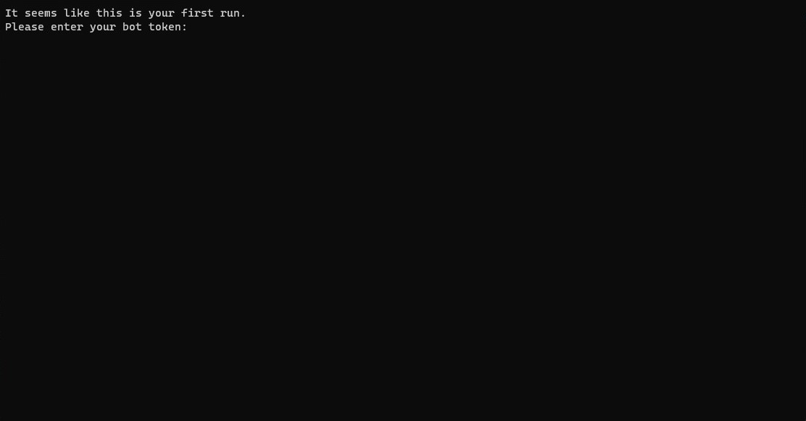
</details>

8. Cuando te lo pidan, pega el token del bot. Puedes hacerlo haciendo clic derecho. Luego, presiona Enter.
<details>
  <summary>Ver imagen</summary>
  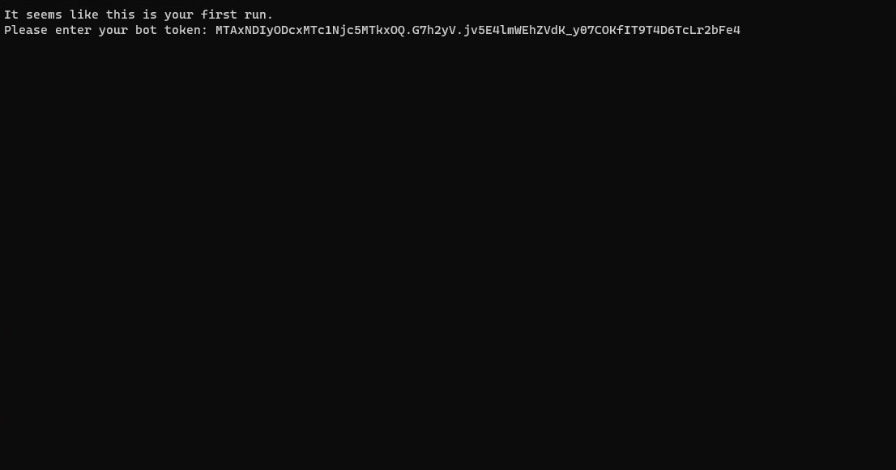
</details>

9. El bot mostrará su enlace de invitación. Ve al enlace usando tu navegador copiando y pegando el enlace. Selecciona el servidor donde quieres usar tu WhatsApp. Luego, haz clic en *"Continuar"* y *"Autorizar"*.
<details>
  <summary>Ver imagen</summary>
  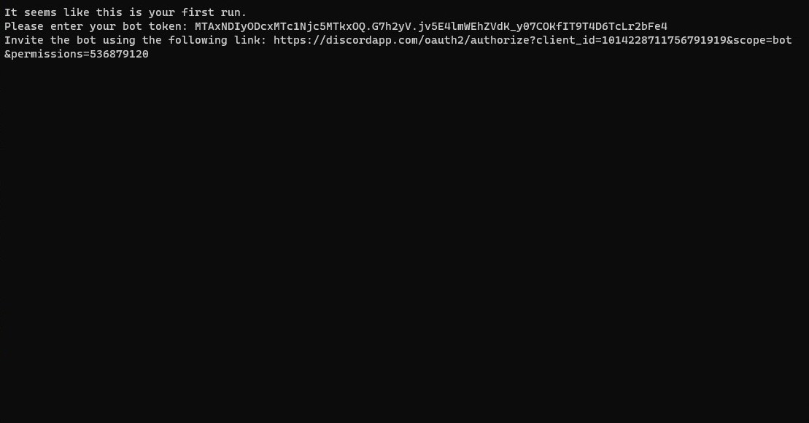
  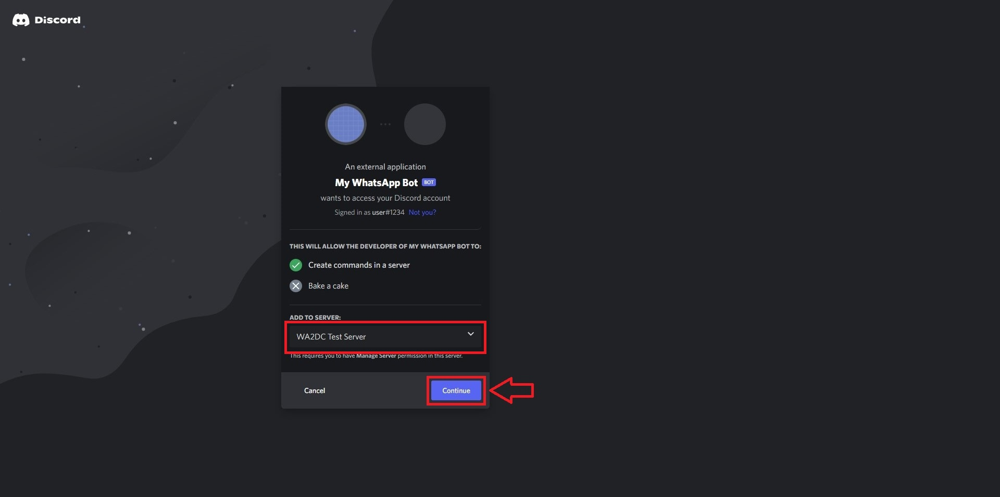
</details>

10. El bot se unirá al servidor y creará algunos canales. Luego, enviará el código QR de WhatsApp Web al canal `#sala-de-control` recién creado.
<details>
  <summary>Ver imagen</summary>
  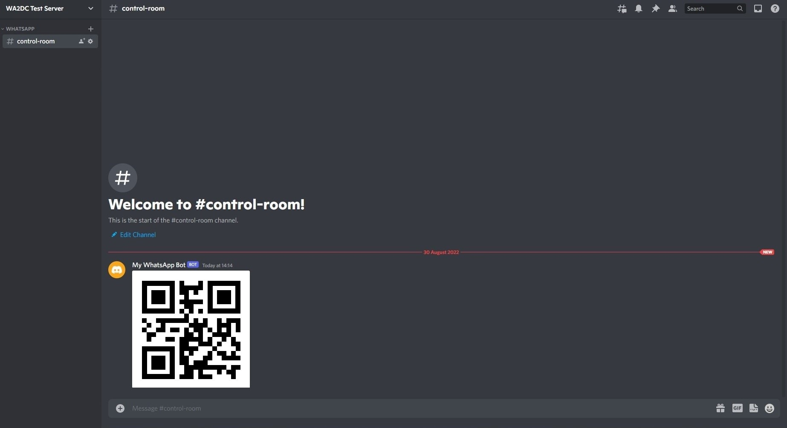
</details>

11. Luego, simplemente escanea el código QR en tu teléfono a través de WhatsApp. Si necesitas ayuda con eso, consulta la [página de ayuda oficial de WhatsApp](https://faq.whatsapp.com/539218963354346/?locale=es_ES).

12. **Paso de seguridad recomendado:** Restringe el acceso a `#sala-de-control` (y a cualquier canal enlazado) usando los permisos de Discord. WA2DC no aplica autorización de comandos por usuario/rol en el código, por lo que los permisos del lado de Discord son el control de acceso previsto.

13. ¡Listo! Ahora puedes explorar los [Comandos](commands.md) para aprender cómo iniciar conversaciones.

# Uso del Bot

Una vez configurado el bot, puedes ejecutarlo de las siguientes maneras:

## Opciones de inicio

<details>
  <summary>Modo manual</summary>
  
  Ejecuta el bot directamente con Node.js:
  
  ```bash
  node .
  ```
  
  **Nota:** Este modo no es persistente. Cerrar la terminal o apagar el equipo detendrá el bot.
  
  
</details>

<details>
  <summary>Modo servicio con PM2 (recomendado)</summary>
  
  PM2 mantiene el bot activo permanentemente y lo reinicia automáticamente si se detiene por algún error.
  
  ### Instalación de PM2
  
  ```bash
  npm install -g pm2
  ```
  
  ### Iniciar el bot con PM2
  
  ```bash
  pm2 start src/index.js --name numier-wa2dc
  ```
  
  ### Comandos útiles de PM2
  
  ```bash
  pm2 status                   # Ver estado de todos los procesos
  pm2 logs numier-wa2dc        # Ver logs en tiempo real
  pm2 stop numier-wa2dc        # Detener el bot
  pm2 restart numier-wa2dc     # Reiniciar el bot
  ```
</details>

## Configuración adicional

<details>
  <summary>Token de autenticación</summary>
  
  - Solicítalo a **Esteban** o agrégalo en el archivo `.env` si ya tienes uno.
</details>

<details>
  <summary>Gestión de grupos de WhatsApp</summary>
  
  - Puedes editar los nombres de los canales en Discord sin afectar el mapeo interno del bot.
  - El bot mantendrá la correspondencia entre los grupos de WhatsApp y los canales de Discord.
  
</details>

# Usuarios de Linux/MacOS

El bot es compatible con todas las plataformas. Los usuarios recibirán la carpeta del proyecto para ejecutarlo localmente.

## Requisitos previos

Asegúrate de tener instalado:
- Node.js (versión 24 o superior)
- PM2 para gestión de procesos

```bash
# Instalar PM2 globalmente
npm install -g pm2
```

## Ejecución en Linux/MacOS

1. Copia la carpeta del proyecto a tu sistema
2. Navega a la carpeta del proyecto:
   ```bash
   cd ruta/a/la/carpeta
   ```
3. Instala las dependencias:
   ```bash
   npm install
   ```
4. Inicia el bot con PM2:
   ```bash
   pm2 start src/index.js --name wa2dc
   ```

## Gestión del bot con PM2

PM2 es la forma recomendada de mantener el bot activo permanentemente:

### Comandos básicos
```bash
pm2 status                  # Ver estado del bot
pm2 logs wa2dc              # Ver logs en tiempo real
pm2 stop wa2dc              # Detener el bot
pm2 restart wa2dc           # Reiniciar el bot
pm2 delete wa2dc            # Eliminar el proceso
pm2 monit                   # Monitorizar recursos
```

### Configuración de PM2
Para configurar el bot para que inicie automáticamente con el sistema:
```bash
pm2 startup
pm2 save
```

## Ejecución en servidor

Para despliegues en servidores, PM2 es especialmente útil:

### Ventajas de PM2 en servidor
- Reinicio automático si el proceso falla
- Gestión de logs integrada
- Monitorización de recursos
- Configuración de clúster si es necesario

### Configuración adicional
Puedes crear un archivo `ecosystem.config.js` para configuraciones avanzadas:

```javascript
module.exports = {
  apps: [{
    name: 'wa2dc',
    script: 'src/index.js',
    instances: 1,
    autorestart: true,
    watch: false,
    max_memory_restart: '1G',
    env: {
      NODE_ENV: 'production'
    }
  }]
};
```

Luego ejecuta con:
```bash
pm2 start ecosystem.config.js
```

### Seguridad en servidor
- Configura firewall para permitir solo los puertos necesarios
- Utiliza autenticación robusta para el acceso al servidor
- Considera usar HTTPS si expones alguna interfaz web
- Mantén el sistema y Node.js actualizados
